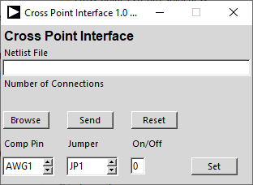

# Crosspoint Project interface for Universal-ALICE
Controling the Software Configurable Breadboard (SCB) hardware is built on top of the Universal ALICE hardware agnostic platform. 
#
Repository for the Python source code and hardware level specification files.
#
The main Universal ALICE GUI is written in Python (3.x) and depends only on the more or less generic standardly available Python plugin libraries (such as Tcl/Tk, numpy, pyplot etc.). The hardware specific interface level is also generally implemented in Python plus any plugin libraries (such as pyserial). The hardware specific interface for the SCB extends the Raspberry Pi Pico interface to include controls for reading LTspice .net or .cir formated netlists.

Crosspoint Interface ALICE Screen

The Pi Pico board must be flashed with the corresponding firmware from the Arduino firmware folder.

If you are not a technical individual or highly familiar with computer operating systems and you have your choice of computers, a Windows computer is highly recommended. You will usually run into fewer issues, if any, with that operating system.

Known Issues: If your computer encrypts files saved on external storge devices (USB disk drives) then the UF2 Bootloader method of flashing firmware to micro-controller boards will not work. You would need to use a different computer that does not encrypt files or consult your local system administrator.

Linux Operating system: On Linux computers access to USB based serial comms devices may not be allowed for non root users by default. A udev rules file needs to be added. Place the 99-arduino.rules from this repository in etc/udev/rules.d

It contains one line per board / vendor:

SUBSYSTEMS=="usb", ATTRS{idVendor}=="2E8A", ATTRS{idProduct}=="000A", GROUP="dialout", MODE="0666"

If this rules file does not work on your version of Linux there may be other things like this that work. Searching the web on how to make serial USB devices work may provide an alternate solution or consult with your local Linux expert.
